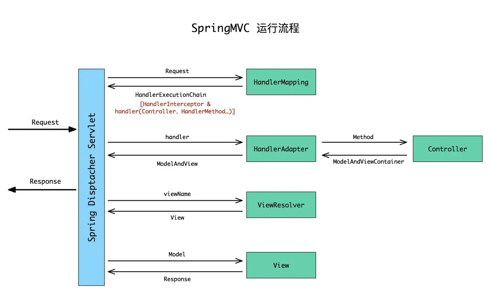
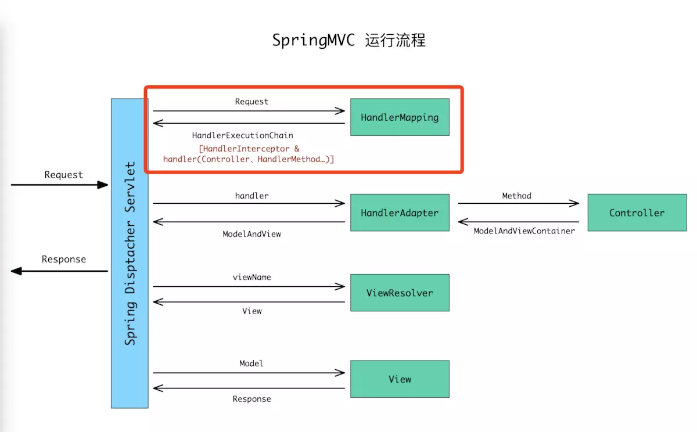
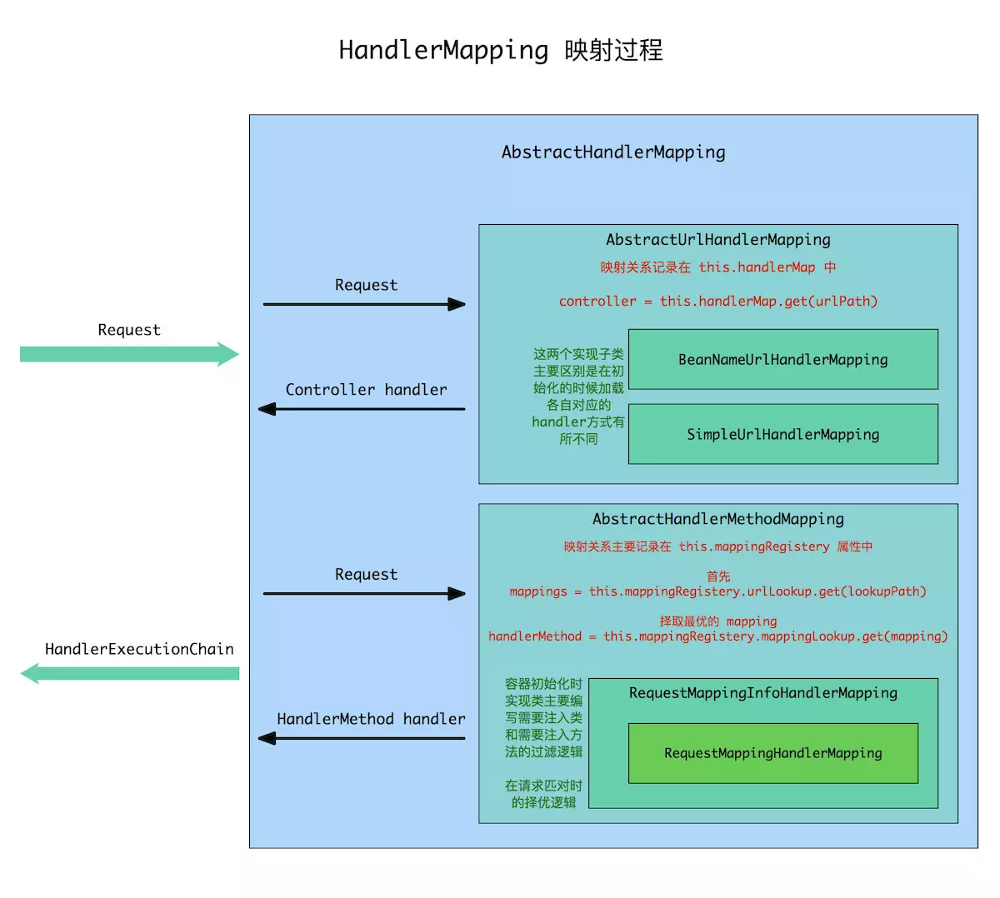

<!-- GFM-TOC --> 
* [Spring MVC 介绍](#Spring-MVC-介绍)
  * [MVC模式](#MVC模式)
    * [MVC的好处](#MVC的好处)
    * [MVC模式在Web中应用](#MVC模式在Web中应用)
  * [Spring MVC](#Spring-MVC)
    * [SpringMVC 特点](#SpringMVC-特点)
* [SpringMVC请求响应](#SpringMVC请求响应)
  * [SpringMVC组件](#SpringMVC组件)
    * [DispatcherServlet 前端控制器](#DispatcherServlet-前端控制器)
    * [HandlerMapping 处理器映射器](#HandlerMapping-处理器映射器)
    * [HandlerAdapter 处理器适配器](#HandlerAdapter-处理器适配器)
    * [Handler 处理器](#Handler-处理器)
    * [ViewResolver 视图解析器](#ViewResolver-视图解析器)
  * [SpringMVC工作详解](#SpringMVC工作详解)
    * [处理器映射 HandlerMapping](#处理器映射-HandlerMapping)
<!-- GFM-TOC --> 

# Spring MVC 介绍

Spring Web MVC是一种基于Java的实现了Web MVC设计模式的请求驱动类型的轻量级Web框架，即使用了MVC架构模式的思想，将web层进行职责解耦，基于请求驱动指的就是使用请求-响应模型。

## MVC模式

**MVC**(Model View Controller)是一种软件设计的框架模式，它采用模型(**Model**)-视图(**View**)-控制器(**Controller**)的方法把业务逻辑、数据与界面显示分离。MVC的理念就是把数据处理、数据展示(界面)和程序/用户的交互三者分离开的一种编程模式。

MVC框架模式是一种复合模式，MVC的三个核心部件分别是
- Model(模型)：所有的用户数据、状态以及程序逻辑，独立于视图和控制器
- View(视图)：呈现模型，类似于Web程序中的界面，视图会从模型中拿到需要展现的状态以及数据，对于相同的数据可以有多种不同的显示形式(视图)
- Controller(控制器)：负责获取用户的输入信息，进行解析并反馈给模型，通常情况下一个视图具有一个控制器

### MVC的好处

程序通过将M(Model)和V(View)的代码分离，实现了前后端代码的分离
- 可以使同一个程序使用不同的表现形式，如果控制器反馈给模型的数据发生了变化，那么模型将及时通知有关的视图，视图会对应的刷新自己所展现的内容
- 模型是独立于视图的，所以模型可复用，模型可以独立的移植到别的地方继续使用
- 前后端的代码分离，使项目开发的分工更加明确，程序的测试更加简便，提高开发效率

### MVC模式在Web中应用

**MVC框架模式在B/S下的应用**

- V：View视图，Web程序中指用户可以看到的并可以与之进行数据交互的界面，比如一个html网页界面，MVC可以为程序处理很多不同的视图，用户在视图中进行输出数据以及一系列操作，注意：视图中不会发生数据的处理操作
- M：Model模型：进行所有数据的处理工作，模型返回的数据是中立的，和数据格式无关，一个模型可以为多个视图来提供数据，所以模型的代码重复性比较低
- C：Controller控制器：负责接受用户的输入，并且调用模型和视图去完成用户的需求，控制器不会输出也不会做出任何处理，只会接受请求并调用模型构件去处理用户的请求，然后在确定用哪个视图去显示返回的数据

1. 浏览器发送请求到控制器;
2. 控制器不能处理请求必须给模型层来处理接着去访问数据库
3. 模型层将处理好的结果返回给控制层
4. 控制层将逻辑视图响应给浏览器.

MVC的本质 : MVC的核心思想是业务数据抽取,同物业数据呈现分离;有利于程序简化,方便编程

**MVC在Web中的优点**
- 耦合性低：视图(页面)和业务层(数据处理)分离，一个应用的业务流程或者业务规则的改变只需要改动MVC中的模型即可，不会影响到控制器与视图
- 部署快，成本低：MVC使开发和维护用户接口的技术含量降低。使用MVC模式使开发时间得到相当大的缩减，它使程序员（Java开发人员）集中精力于业务逻辑，界面程序员（HTML和JSP开发人员）集中精力于表现形式上
- 可维护性高：分离视图层和业务逻辑层也使得WEB应用更易于维护和修改
  
**MVC在Web中的缺点**
- 调试困难：因为模型和视图要严格的分离，这样也给调试应用程序带来了一定的困难，每个构件在使用之前都需要经过彻底的测试
- 不适合小型，中等规模的应用程序：在一个中小型的应用程序中，强制性的使用MVC进行开发，往往会花费大量时间，并且不能体现MVC的优势，同时会使开发变得繁琐
- 增加系统结构和实现的复杂性：对于简单的界面，严格遵循MVC，使模型、视图与控制器分离，会增加结构的复杂性，并可能产生过多的更新操作，降低运行效率
- 视图与控制器间的过于紧密的连接并且降低了视图对模型数据的访问：视图与控制器是相互分离，但却是联系紧密的部件，视图没有控制器的存在，其应用是很有限的，反之亦然，这样就妨碍了他们的独立重用。依据模型操作接口的不同，视图可能需要多次调用才能获得足够的显示数据。对未变化数据的不必要的频繁访问，也将损害操作性能

## Spring MVC

Spring MVC采用了松散耦合的可插拔组件结构，比其他的MVC框架更具有灵活性和扩展性，Spring MVC通过使用一套注解，使一个Java类成为前端控制器(Controller)，不需要实现任何接口，同时，Spring MVC支持REST形式的URL请求，除此之外，Spring MVC在在数据绑定、视图解析、本地化处理及静态资源处理上都有许多不俗的表现。

### SpringMVC 特点

1. 清晰的角色划分：
   - 前端控制器（DispatcherServlet）
   - 请求到处理器映射（HandlerMapping）
   - 处理器适配器（HandlerAdapter）
   - 视图解析器（ViewResolver）
   - 处理器或页面控制器（Controller）
   - 验证器（ Validator）
   - 表单对象（Form Object 提供给表单展示和提交到的对象就叫表单对象）
2. 由于命令对象就是一个POJO，无需继承框架特定API，可以使用命令对象直接作为业务对象；
3. 和Spring 其他框架无缝集成，是其它Web框架所不具备的；
4. 可适配，通过HandlerAdapter可以支持任意的类作为处理器；
5. 可定制性，HandlerMapping、ViewResolver等能够非常简单的定制；
6. 功能强大的数据验证、格式化、绑定机制；
7. 利用Spring提供的Mock对象能够非常简单的进行Web层单元测试；
8. 本地化、主题的解析的支持，使我们更容易进行国际化和主题的切换。
9. 非常容易与其它视图技术集成，如Velocity、FreeMarker等，因为模型数据不放在特定的API里，而是放在一 个Model里（Map数据结构实现，因此很容易被其他框架使用）。
10. RESTful风格的支持、简单的文件上传、约定优于配置的契约式编程支持、基于注解的零配置支持。

# SpringMVC请求响应

具体步骤：
1. 发起请求到前端控制器(DispatcherServlet)
2. 前端控制器请求HandlerMapping查找 Handler （可以根据xml配置、注解进行查找）
3. 处理器映射器HandlerMapping向前端控制器返回Handler，HandlerMapping会把请求映射为HandlerExecutionChain对象(包含一个Handler处理器（页面控制器）对象，多个HandlerInterceptor拦截器对象），通过这种策略模式，很容易添加新的映射策略
4. 前端控制器调用处理器适配器去执行Handler
5. 处理器适配器HandlerAdapter将会根据适配的结果去执行Handler
6. Handler执行完成给适配器返回ModelAndView
7. 处理器适配器向前端控制器返回ModelAndView （ModelAndView是springmvc框架的一个底层对象，包括 Model和view）
8. 前端控制器请求视图解析器去进行视图解析 （根据逻辑视图名解析成真正的视图(jsp)），通过这种策略很容易更换其他视图技术，只需要更改视图解析器即可
9. 视图解析器向前端控制器返回View
10. 前端控制器进行视图渲染 （视图渲染将模型数据(在ModelAndView对象中)填充到request域）
11. 前端控制器向用户响应结果

## SpringMVC组件

### DispatcherServlet 前端控制器

- 用户请求到达前端控制器,相当于MVC中的C
- DispatcherServlet是整个流程的核心,它来调用其他组件来处理用户请求,前端控制器的存在降低了其他组件之间的耦合度.

### HandlerMapping 处理器映射器

- HandlerMapping 负责根据用户请求找到Handler即处理器。（如用户自定义的Controller）SpringMVC提供了不同的映射器实现不同的映射方式，例如：配置文件方式，实现接口方式，注解方式等。
- 映射器相当于配置信息或注解描述。映射器内部封装了一个类似map的数据结构。使用URL作为key，HandlerExecutionChain作为value。核心控制器，可以通过请求对象（请求对象中包含请求的 URL）在handlerMapping中查询HandlerExecutionChain对象。
- 是SpringMVC核心组件之一。是必不可少的组件。无论是否配置，SpringMVC 会有默认提供。
- 默认的映射器是：RequestMappingHandlerMapping。（老版本中有其他的映射器，但是已经过时。）
  
### HandlerAdapter 处理器适配器

- 通过HandlerAdapter对处理器（Handler）进行执行，这是适配器模式的应用，通过扩展适配器可以对更多类型的处理器进行执行。
- 适配器也是 SpringMVC 中的核心组件之一。必须存在。SpringMVC 框架有默认值。
- 典型的适配器：SimpleControllerHandlerAdapter，最基础的。处理自定义控制器（Handler）和SpringMVC控制器顶级接口Controller之间关联的。

### Handler 处理器

- Handler 是后端控制器, 在前端控制器的控制下后端控制器对具体的用户请求进行处理，Handler涉及到具体的用户请求,所以一般情况下需要程序员根据自己的业务开发
- 在SpringMVC中对Handler没有强制的类型要求。在SpringMVC框架中，对Handler的引用定义类型为Object
- 处理器理论上说不是必要的核心组件。
- SpringMVC框架是一个线程不安全的，轻量级的框架。一个handler对象，处理所有的请求。开发过程中，注意线程安全问题。

### ViewResolver 视图解析器
- ViewResolver 负责将处理结果生成 View 视图，ViewResolver 首先根据逻辑视图名解析成物理视图名即具体的页面地址，再生成 View 视图对象，最后对 View 进行渲染将处理结果通过页面展示给用户。
- 是SpringMVC中必要的组件之一。SpringMVC提供默认视图解析器。

## SpringMVC工作详解

### 处理器映射 HandlerMapping

SpringMVC 内部是根据 HandlerMapping 将 Request 和 Controller 里面的方法对应起来的。
`HandlerMapping` 功能就是根据请求匹配到对应的 `Handler，然后将找到的` `Handler` 和所有匹配的 `HandlerInterceptor` （拦截器）绑定到创建的 `HandlerExecutionChain` 对象上并返回。

`HandlerMapping` 只是一个接口类，不同的实现类有不同的匹对方式，根据功能的不同我们需要在 SpringMVC 容器中注入不同的映射处理器 `HandlerMapping。`

#### HandlerMapping 接口

**类结构**
- HandlerMapping
  - AbstractHandlerMapping
    - AbstractUrlHandlerMapping
      - BeanNameUrlHandlerMapping
      - SimpleUrlHandlerMapping
    - AbstractHandlerMethodMapping

#### AbstractHandlerMapping

#### AbstractUrlHandlerMapping

##### BeanNameUrlHandlerMapping

##### SimpleUrlHandlerMapping

#### AbstractHandlerMethodMapping

