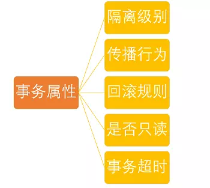
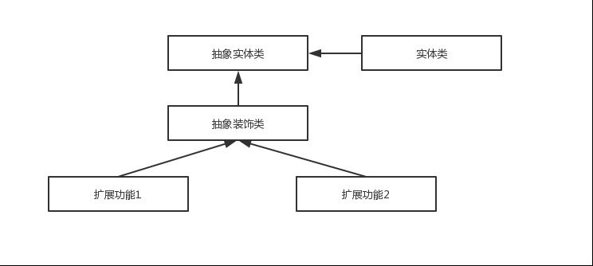

<!-- GFM-TOC -->
* [Spring 介绍](#Spring-介绍)
  * [Spring模块](#Spring模块)
* [Spring IoC](#Spring-IoC)
  * [Spring IOC 工作过程](#Spring-IOC-工作过程)
  * [Spring依赖注入](#Spring依赖注入)
  * [Spring Bean](#Spring-Bean)
    * [bean 作用域](#bean-作用域)
    * [bean 生命周期](#bean-生命周期)
    * [单例 bean 的线程安全](#单例-bean-的线程安全)
* [Spring AOP](#Spring-AOP)
  * [Spring AOP 和 AspectJ AOP](#Spring-AOP-和-AspectJ-AOP)
    * [Spring AOP 基于AspectJ注解实现AOP](#Spring-AOP-基于AspectJ注解实现AOP)
  * [AOP 基本概念](#AOP-基本概念)
  * [Spring AOP 实现方式](#Spring-AOP-实现方式)
    * [基于 Schema(Spring AOP)](#基于-SchemaSpring-AOP)
    * [基于 AspectJ(Spring + AspectJ)](#基于-AspectJSpring--AspectJ)
    * [实现对比](#实现对比)
* [Spring 事务](#Spring-事务)
  * [Spring事务管理方式](#Spring事务管理方式)
  * [Spring事务管理接口](#Spring事务管理接口)
  * [事务属性](#事务属性)
    * [事务隔离级别](#事务隔离级别)
    * [事务传播行为](#事务传播行为)
    * [事务超时属性](#事务超时属性)
    * [事务只读属性](#事务只读属性)
    * [事务回滚规则](#事务回滚规则)
* [Spring 注解](#Spring-注解)
  * [声明Bean](#声明Bean)
  * [注入Bean](#注入Bean)
  * [配置类相关注解](#配置类相关注解)
  * [切面(AOP)相关注解](#切面AOP相关注解)
  * [属性注入](#属性注入)
  * [事务相关注解](#事务相关注解)
* [Spring 中的设计模式](#Spring-中的设计模式)
  * [工厂模式](#工厂模式)
  * [单例模式](#单例模式)
  * [代理模式](#代理模式)
    * [代理模式在AOP中的应用](#代理模式在AOP中的应用)
  * [模板方法](#模板方法)
  * [观察者模式](#观察者模式)
    * [Spring 事件驱动模型中的三种角色](#Spring-事件驱动模型中的三种角色)
    * [Spring 的事件流程总结](#Spring-的事件流程总结)
  * [适配器模式](#适配器模式)
    * [spring AOP中的适配器模式](#spring-AOP中的适配器模式)
  * [装饰者模式](#装饰者模式)
  * [总结](#总结)
* [Spring 源码阅读](#Spring-源码阅读)
<!-- GFM-TOC -->

# Spring 介绍

Spring 框架指的都是 Spring Framework，它是很多模块的集合，使用这些模块可以很方便地协助我们进行开发。这些模块是：核心容器、数据访问/集成,、Web、AOP（面向切面编程）、工具、消息和测试模块。

Spring 官网列出的 Spring 的 6 个特征:

- **核心技术** ：依赖注入(DI)，AOP，事件(events)，资源，i18n，验证，数据绑定，类型转换，SpEL。
- **测试** ：模拟对象，TestContext框架，Spring MVC 测试，WebTestClient。
- **数据访问** ：事务，DAO支持，JDBC，ORM，编组XML。
- **Web支持** : Spring MVC和Spring WebFlux Web框架。
- **集成** ：远程处理，JMS，JCA，JMX，电子邮件，任务，调度，缓存。
- **语言** ：Kotlin，Groovy，动态语言。

## Spring模块

下图对应的是 Spring4.x 版本。目前最新的5.x版本中 Web 模块的 Portlet 组件已经被废弃掉，同时增加了用于异步响应式处理的 WebFlux 组件。


- **Spring Core**： 基础,可以说 Spring 其他所有的功能都需要依赖于该类库。主要提供 IoC 依赖注入功能。
- **Spring Context**: 构建于Core封装包基础上的 Context封装包，提供了一种框架式的对象访问方法，有些象JNDI注册器。Context封装包的特性得自于Beans封装包，并添加了对国际化（I18N）的支持（例如资源绑定），事件传播，资源装载的方式和Context的透明创建，比如说通过Servlet容器。
- **Spring Aspects** ： 该模块为与AspectJ的集成提供支持。
- **Spring AOP** ：提供了面向切面的编程实现。
- **Spring JDBC** : Java数据库连接。
- **Spring JMS** ：Java消息服务。
- **Spring ORM** : 用于支持Hibernate等ORM工具。
- **Spring DAO**:  DAO (Data Access Object)提供了JDBC的抽象层，它可消除冗长的JDBC编码和解析数据库厂商特有的错误代码。 并且，JDBC封装包还提供了一种比编程性更好的声明性事务管理方法，不仅仅是实现了特定接口，而且对所有的POJOs（plain old Java objects）都适用。
- **Spring Web** : 为创建Web应用程序提供支持。
- **Spring Test** : 提供了对 JUnit 和 TestNG 测试的支持。

# Spring IoC

IoC（Inverse of Control:控制反转）是一种设计思想，就是 将原本在程序中手动创建对象的控制权，交由Spring框架来管理。 IoC 在其他语言中也有应用，并非 Spirng 特有。 IoC 容器是 Spring 用来实现 IoC 的载体， IoC 容器实际上就是个Map（key，value）,Map 中存放的是各种对象。

**IoC 容器就像是一个工厂一样，当我们需要创建一个对象的时候，只需要配置好配置文件/注解即可，完全不用考虑对象是如何被创建出来的。**

IOC是控制反转，实际上获得依赖对象的过程被反转了，获得依赖对象的过程由自身管理变为了由IOC容器主动注入，即“**依赖注入**（Dependency Injection）”。所谓依赖注入，就是由IOC容器在运行期间，动态地将某种依赖关系注入到对象之中。

**依赖注入**(DI)和**控制反转**(IOC)是从不同的角度的描述的同一件事情，就是指通过引入IOC容器，利用依赖关系注入的方式，实现对象之间的**解耦**。

IOC容器的工作模式看做是**工厂模式**的升华，可以把IOC容器看作是一个工厂，这个工厂里要生产的对象都在配置文件中给出定义，然后利用编程语言的的**反射**编程，根据配置文件中给出的类名生成相应的对象。从实现来看，IOC是把以前在工厂方法里写死的对象生成代码，改变为由配置文件来定义，也就是把工厂和对象生成这两者独立分隔开来，目的就是提高灵活性和可维护性

Spring 时代我们一般通过 XML 文件来配置 Bean，后来开发人员觉得 XML 文件来配置不太好，于是 SpringBoot 注解配置就慢慢开始流行起来。

## Spring IOC 工作过程

**Spring IoC的初始化过程：** 读取XML资源，并解析，最终注册到Bean Factory中


1. 准备：在调用ClassPathXmlApplicationContext后，先会将配置位置信息保存到configLocations，供后面解析使用，之后，会调用AbstractApplicationContext的refresh方法进行刷新
2. 读取：创建处理每一个resource，处理XML每个元素，解析和注册bean。通过parseBeanDefinitionElement将XML的元素解析为BeanDefinition，然后存在BeanDefinitionHolder中，然后再利用BeanDefinitionHolder将BeanDefinition注册，实质就是把BeanDefinition的实例put进BeanFactory中
3. 解析：处理每个Bean的元素，处理属性的值
4. 注册：最核心的一句就是：this.beanDefinitionMap.put(beanName, beanDefinition)，也就是说注册的实质就是以beanName为key，以beanDefinition为value，将其put到HashMap中

当完成初始化IOC容器后，如果bean没有设置lazy-init(延迟加载)属性，那么bean的实例就会在初始化IOC完成之后，及时地进行初始化。初始化时会先建立实例，然后根据配置利用反射对实例进行进一步操作，具体流程如下所示


1. 创建bean的实例
2. 注入bean的属性

[IoC源码阅读](https://javadoop.com/post/spring-ioc)

## Spring依赖注入

- setter方式注入（设值注入）
- 构造器方式注入
  - Spring支持利用构造器注入参数实例化Bean方式。只要在Spring的配置文件中增加构造器参数constructor-arg
  - Spring就会自动的调用有参数的构造器创建bean对象实例, 整个过程无需程序编码只需要配置applicationContext.xml文件即可
- 自动装配功能实现属性自动注入
  - Spring IoC容器可以自动装配（autowire）相互协作bean之间的关联关系，autowire可以针对单个bean进行设置，autowire的方便之处在于减少xml的注入配置。

当设值注入与构造注入同时存在时，先执行构造注入，再执行设值注入。

设置注入
- 与传统的JavaBean的写法更相似，程序开发人员更容易理解、接受。通过setter方法设定依赖关系显得更加直观、自然。
- 对于复杂的依赖关系，如果采用构造注入，会导致构造器过于臃肿，难以阅读。Spring在创建Bean实例时，需要同时实例化其依赖的全部实例，因而导致性能下降。而是用设置注入可以避免这些问题。
- 尤其在某些属性可选的情况下，多参数的构造器更加笨重。

构造器注入
- 构造注入可以再构造器中决定依赖关系的注入顺序，有限依赖的优先注入。例如，组件中其它依赖关系的注入，常常需要依赖于Datasource的注入。采用构造注入，可以在代码中清晰地决定注入顺序。
- 对于依赖关系无需变化的Bean，构造注入更加有用。因为没有setter方法，所有的依赖关系全部在构造器内设定。因此，无需担心后续代码对依赖关系的破坏。
- 依赖关系只能在构造器中设定，则只有组建的创建者才能改变组建的依赖关系。队组建的调用者而言，组件内部的依赖关系完全透明，更符合高内聚的原则。


## Spring Bean

###  bean 作用域

- singleton : 唯一 bean 实例，Spring 中的 bean 默认都是单例的。
- prototype : 每次请求都会创建一个新的 bean 实例。即每次调用getBean() 想当于new XxxBean()
- request : 每一次HTTP请求都会产生一个新的bean，该bean仅在当前HTTP request内有效。
- session : 每一次HTTP请求都会产生一个新的 bean，该bean仅在当前 HTTP session 内有效。
- globalSession： 全局session作用域，仅仅在基于portlet的web应用中才有意义，Spring5已经没有了。Portlet是能够生成语义代码(例如：HTML)片段的小型Java Web插件。它们基于portlet容器，可以像servlet一样处理HTTP请求。但是，与 servlet 不同，每个 portlet 都有不同的会话

五种作用域中，request、session 和 globalSession 三种作用域仅在基于web的应用中使用，只能用在基于 web 的 Spring ApplicationContext 环境。

#### singleton

唯一 bean 实例

**当一个 bean 的作用域为 singleton，那么Spring IoC容器中只会存在一个共享的 bean 实例，并且所有对 bean 的请求，只要 id 与该 bean 定义相匹配，则只会返回bean的同一实例。** singleton 是单例类型(对应于单例模式)，就是在创建起容器时就同时自动创建了一个bean的对象，不管你是否使用，但我们可以指定Bean节点的 `lazy-init=”true”` 来延迟初始化bean，这时候，只有在第一次获取bean时才会初始化bean，即第一次请求该bean时才初始化。 每次获取到的对象都是同一个对象。注意，singleton 作用域是Spring中的缺省作用域。要在XML中将 bean 定义成 singleton ，可以这样配置：

```xml
<bean id="ServiceImpl" class="cn.service.ServiceImpl" scope="singleton">
```
也可以通过 `@Scope` 注解（它可以显示指定bean的作用范围。）的方式

```java
@Service
@Scope("singleton")
public class ServiceImpl{

}
```
#### prototype

每次请求都会创建一个新的 bean 实例

**当一个bean的作用域为 prototype，表示一个 bean 定义对应多个对象实例。prototype 作用域的 bean 会导致在每次对该 bean 请求**（将其注入到另一个 bean 中，或者以程序的方式调用容器的 getBean() 方法）时都会创建一个新的 bean 实例。prototype 是原型类型，它在我们创建容器的时候并没有实例化，而是当我们获取bean的时候才会去创建一个对象，而且我们每次获取到的对象都不是同一个对象。根据经验，对有状态的 bean 应该使用 prototype 作用域，而对无状态的 bean 则应该使用 singleton 作用域。在 XML 中将 bean 定义成 prototype ，可以这样配置：

```java
<bean id="account" class="com.foo.DefaultAccount" scope="prototype"/>  
 或者
<bean id="account" class="com.foo.DefaultAccount" singleton="false"/> 
```
同样可以通过 `@Scope` 注解的方式实现

#### request 

**request只适用于Web程序，每一次 HTTP 请求都会产生一个新的bean，同时该bean仅在当前HTTP request内有效，当请求结束后，该对象的生命周期即结束。** 在 XML 中将 bean 定义成 request ，可以这样配置：

```java
<bean id="loginAction" class=cn.LoginAction" scope="request"/>
```
#### session

**session只适用于Web程序，session 作用域表示该针对每一次 HTTP 请求都会产生一个新的 bean，同时该 bean 仅在当前 HTTP session 内有效.与request作用域一样，可以根据需要放心的更改所创建实例的内部状态，而别的 HTTP session 中根据 userPreferences 创建的实例，将不会看到这些特定于某个 HTTP session 的状态变化。当HTTP session最终被废弃的时候，在该HTTP session作用域内的bean也会被废弃掉。**

```xml
<bean id="userPreferences" class="com.foo.UserPreferences" scope="session"/>
```

#### globalSession

global session 作用域类似于标准的 HTTP session 作用域，不过仅仅在基于 portlet 的 web 应用中才有意义。Portlet 规范定义了全局 Session 的概念，它被所有构成某个 portlet web 应用的各种不同的 portlet所共享。在global session 作用域中定义的 bean 被限定于全局portlet Session的生命周期范围内。

```xml
<bean id="user" class="com.foo.Preferences "scope="globalSession"/>
```


### bean 生命周期

- Bean 容器找到配置文件中 Spring Bean 的定义。
- Bean 容器利用 Java Reflection API 创建一个Bean的实例。
- 如果涉及到一些属性值 利用 `set()`方法设置一些属性值。
- 如果 Bean 实现了 `BeanNameAware` 接口，调用 `setBeanName()`方法，传入Bean的名字。
- 如果 Bean 实现了 `BeanClassLoaderAware` 接口，调用 `setBeanClassLoader()`方法，传入 `ClassLoader`对象的实例。
- 如果Bean实现了 `BeanFactoryAware` 接口，调用 `setBeanClassLoader()`方法，传入 `ClassLoader` 对象的实例。
- 与上面的类似，如果实现了其他 `*.Aware`接口，就调用相应的方法。
- 如果有和加载这个 Bean 的 Spring 容器相关的 `BeanPostProcessor` 对象，执行`postProcessBeforeInitialization()` 方法
- 如果Bean实现了`InitializingBean`接口，执行`afterPropertiesSet()`方法。
- 如果 Bean 在配置文件中的定义包含  init-method 属性，执行指定的方法。
- 如果有和加载这个 Bean的 Spring 容器相关的 `BeanPostProcessor` 对象，执行`postProcessAfterInitialization()` 方法
- 当要销毁 Bean 的时候，如果 Bean 实现了 `DisposableBean` 接口，执行 `destroy()` 方法。
- 当要销毁 Bean 的时候，如果 Bean 在配置文件中的定义包含 destroy-method 属性，执行指定的方法。

图示：


与之比较类似的中文版本:


**Spring管理的单例/非单例对象**

Spring 容器可以管理 singleton 作用域下 bean 的生命周期，在此作用域下，Spring 能够精确地知道bean何时被创建，何时初始化完成，以及何时被销毁。而对于 prototype 作用域的bean，Spring只负责创建，当容器创建了 bean 的实例后，bean 的实例就交给了客户端的代码管理，Spring容器将不再跟踪其生命周期，并且不会管理那些被配置成prototype作用域的bean的生命周期。


### 单例 bean 的线程安全

大部分时候我们并没有在系统中使用多线程，所以很少有人会关注这个问题。单例 bean 存在线程问题，主要是因为当多个线程操作同一个对象的时候，对这个对象的非静态成员变量的写操作会存在线程安全问题。

常见的有两种解决办法：

1. 在Bean对象中尽量避免定义可变的成员变量（不太现实）。

2. 在类中定义一个ThreadLocal成员变量，将需要的可变成员变量保存在 ThreadLocal 中（推荐的一种方式）。

# Spring AOP

AOP(Aspect-Oriented Programming:面向切面编程)能够将那些与业务无关，**却为业务模块所共同调用的逻辑或责任（例如事务处理、日志管理、权限控制等）封装起来**，便于**减少系统的重复代码**，**降低模块间的耦合度**，并**有利于未来的可拓展性和可维护性**。

AOP思想的实现一般都是基于 **代理模式** ，在JAVA中一般采用JDK动态代理模式，但是我们都知道，**JDK动态代理模式只能代理接口而不能代理类**。因此，Spring AOP 会这样子来进行切换，因为Spring AOP 同时支持 CGLIB、ASPECTJ、JDK动态代理。
- 如果目标对象的实现类实现了接口，Spring AOP 将会采用 JDK 动态代理来生成 AOP 代理类；
- 如果目标对象的实现类没有实现接口，Spring AOP 将会采用 CGLIB 来生成 AOP 代理类;不过这个选择过程对开发者完全透明、开发者也无需关心。


当然你也可以使用 AspectJ ,Spring AOP 已经集成了AspectJ ，AspectJ 应该算的上是 Java 生态系统中最完整的 AOP 框架了。

使用 AOP 之后我们可以把一些通用功能抽象出来，在需要用到的地方直接使用即可，这样大大简化了代码量。我们需要增加新功能时也方便，这样也提高了系统扩展性。日志功能、事务管理等等场景都用到了 AOP 

## Spring AOP 和 AspectJ AOP

Spring AOP 属于**运行时增强**，而 AspectJ 是**编译时增强**。 Spring AOP 基于代理(Proxying)，而 AspectJ 基于字节码操作(Bytecode Manipulation)。

Spring AOP 已经集成了 AspectJ ，AspectJ 应该算的上是 Java 生态系统中最完整的 AOP 框架了。AspectJ 相比于 Spring AOP 功能更加强大，但是 Spring AOP 相对来说更简单，

如果我们的切面比较少，那么两者性能差异不大。但是，当切面太多的话，最好选择 AspectJ ，它比Spring AOP 快很多。


### Spring AOP 基于AspectJ注解实现AOP

**AspectJ是一个AOP框架，它能够对java代码进行AOP编译（一般在编译期进行），让java代码具有AspectJ的AOP功能（当然需要特殊的编译器）**，可以这样说AspectJ是目前实现AOP框架中最成熟，功能最丰富的语言，更幸运的是，AspectJ与java程序完全兼容，几乎是无缝关联，因此对于有java编程基础的工程师，上手和使用都非常容易。Spring注意到AspectJ在AOP的实现方式上依赖于特殊编译器(ajc编译器)，因此Spring很机智回避了这点，转向采用动态代理技术的实现原理来构建Spring AOP的内部机制（动态织入），这是与AspectJ（静态织入）最根本的区别。**Spring 只是使用了与 AspectJ 5 一样的注解，但仍然没有使用 AspectJ 的编译器，底层依是动态代理技术的实现，因此并不依赖于 AspectJ 的编译器**。 Spring AOP虽然是使用了那一套注解，其实实现AOP的底层是使用了动态代理(JDK或者CGLib)来动态织入。

## AOP 基本概念

- 通知(Adivce)：通知有5种类型
    - Before：在方法被调用之前调用
    - After：在方法完成后调用通知，无论方法是否执行成功
    - After-returning：在方法成功执行之后调用通知
    - After-throwing：在方法抛出异常后调用通知
    - Around：在被通知的方法调用之前后调用之后执行自定义的行为
- 切点（Pointcut）：对应系统中的方法；这个方法是定义在切面中的方法，一般和通知一起使用，一起组成了切面。
- 连接点（Join point）：理论上, 程序执行过程中的任何时点都可以作为作为织入点, 而所有这些执行时点都是 Joint point；但 Spring AOP 目前仅支持方法执行 (method execution)也可以这样理解，连接点就是你准备在系统中执行切点和切入通知的地方（一般是一个方法，一个字段）
- 切面（Aspect）：切面是切点和通知的集合，一般单独作为一个类。通知和切点共同定义了关于切面的全部内容，它是什么时候，在何时和何处完成功能
- 引入（Introduction）：引用允许我们向现有的类添加新的方法或者属性
- 织入（Weaving）：组装方面来创建一个被通知对象。这可以在编译时完成（例如使用AspectJ编译器），也可以在运行时完成。Spring和其他纯Java AOP框架一样，在运行时完成织入。

## Spring AOP 实现方式

### 基于 Schema(Spring AOP)

Spring默认支持的AOP方式

**分类**
- 编程式
- 声明式(基于配置)
  - 手工代理
  - 自动代理
    - 扫描 Bean 名称
    - 扫描切面配置

**注意**
- 基于XML的方式配置(在 `<aop:config>` 配置)
- 每个通知都需要实现接口或类

### 基于 AspectJ(Spring + AspectJ)

**分类**
- 基于配置(在 `<aop:config>` 的子标签 `<aop:aspect>`中配置)
- 基于注解

**注意**
- 每个通知不需要实现接口或类

### 实现对比

**织入的时期不同**
- Spring Aop采用的动态织入。动态织入又分静动两种，静则指织入过程只在第一次调用时执行；动则指根据代码动态运行的中间状态来决定如何操作，每次调用Target的时候都执行。
- Aspectj是静态织入。静态织入：指在编译时期就织入，即：编译出来的class文件，字节码就已经被织入了。

**使用对象不同**
- Spring AOP的通知是基于该对象是SpringBean对象才可以
- AspectJ可以在任何Java对象上应用通知


# Spring 事务

## Spring事务管理方式

Spring 管理事务的方式
1. 编程式事务：在代码中硬编码。(不推荐使用)(通过Transaction Template手动管理事务)
2. 声明式事务：在配置文件中配置（推荐使用）(实际是通过AOP实现)

**声明式事务又分为两种：**

1. 基于XML的声明式事务：基于 `<tx>` 和 `<aop>` 命名空间的声明式事务管理： 目前推荐的方式，其最大特点是与 Spring AOP 结合紧密，可以充分利用切点表达式的强大支持，使得管理事务更加灵活。
2. 基于注解的声明式事务：基于 @Transactional 的全注解方式： 将声明式事务管理简化到了极致。开发人员只需在配置文件中加上一行启用相关后处理 Bean 的配置，然后在需要实施事务管理的方法或者类上使用 @Transactional 指定事务规则即可实现事务管理，而且功能也不必其他方式逊色。


## Spring事务管理接口


- PlatformTransactionManager： （平台）事务管理器
- TransactionDefinition： 事务定义信息(事务隔离级别、传播行为、超时、只读、回滚规则)
- TransactionStatus： 事务运行状态

所谓事务管理，其实就是“按照给定的事务规则来执行提交或者回滚操作”。


**PlatformTransactionManager**
- Spring并不直接管理事务，而是提供了多种事务管理器 ，他们将事务管理的职责委托给Hibernate或者JTA等持久化机制所提供的相关平台框架的事务来实现。 Spring事务管理器的接口是： org.springframework.transaction.PlatformTransactionManager ，通过这个接口，Spring为各个平台如JDBC、Hibernate等都提供了对应的事务管理器，但是具体的实现就是各个平台自己的事情了。
- 事务管理器接口 PlatformTransactionManager 通过 getTransaction(TransactionDefinition definition) 方法来得到一个事务，这个方法里面的参数是 TransactionDefinition类 ，这个类就定义了一些基本的事务属性。

**TransactionDefinition** 接口中定义了5个方法以及一些表示事务属性的常量比如隔离级别、传播行为等等的常量。

**TransactionStatus** 接口用来记录事务的状态 该接口定义了一组方法,用来获取或判断事务的相应状态信息
- PlatformTransactionManager.getTransaction(...) 方法返回一个 TransactionStatus 对象。返回的TransactionStatus 对象可能代表一个新的或已经存在的事务（如果在当前调用堆栈有一个符合条件的事务）。

## 事务属性



### 事务隔离级别

在典型的应用程序中，多个事务并发运行，经常会操作相同的数据来完成各自的任务（多个用户对统一数据进行操作）,并发虽然是必须的，但可能会导致一下的问题。

**TransactionDefinition 接口中定义了五个表示隔离级别的常量：**

- **TransactionDefinition.ISOLATION_DEFAULT:**          使用后端数据库默认的隔离级别，Mysql 默认采用的 REPEATABLE_READ隔离级别 Oracle 默认采用的 READ_COMMITTED隔离级别.
- **TransactionDefinition.ISOLATION_READ_UNCOMMITTED:** 最低的隔离级别，允许读取尚未提交的数据变更，**可能会导致脏读、幻读或不可重复读**
- **TransactionDefinition.ISOLATION_READ_COMMITTED:**   允许读取并发事务已经提交的数据，**可以阻止脏读，但是幻读或不可重复读仍有可能发生**
- **TransactionDefinition.ISOLATION_REPEATABLE_READ:**  对同一字段的多次读取结果都是一致的，除非数据是被本身事务自己所修改，**可以阻止脏读和不可重复读，但幻读仍有可能发生。**
- **TransactionDefinition.ISOLATION_SERIALIZABLE:**     最高的隔离级别，完全服从ACID的隔离级别。所有的事务依次逐个执行，这样事务之间就完全不可能产生干扰，也就是说，**该级别可以防止脏读、不可重复读以及幻读**。但是这将严重影响程序的性能。通常情况下也不会用到该级别。

### 事务传播行为

当事务方法被另一个事务方法调用时，必须指定事务应该如何传播。例如：方法可能继续在现有事务中运行，也可能开启一个新事务，并在自己的事务中运行。

Spring 事务中的事务传播行为：

**支持当前事务的情况：**

- **TransactionDefinition.PROPAGATION_REQUIRED：** 如果当前存在事务，则加入该事务；如果当前没有事务，则创建一个新的事务。
- **TransactionDefinition.PROPAGATION_SUPPORTS：** 如果当前存在事务，则加入该事务；如果当前没有事务，则以非事务的方式继续运行。
- **TransactionDefinition.PROPAGATION_MANDATORY：** 如果当前存在事务，则加入该事务；如果当前没有事务，则抛出异常。（mandatory：强制性）

**不支持当前事务的情况：**

- **TransactionDefinition.PROPAGATION_REQUIRES_NEW：** 创建一个新的事务，如果当前存在事务，则把当前事务挂起。
- **TransactionDefinition.PROPAGATION_NOT_SUPPORTED：** 以非事务方式运行，如果当前存在事务，则把当前事务挂起。
- **TransactionDefinition.PROPAGATION_NEVER：** 以非事务方式运行，如果当前存在事务，则抛出异常。

**其他情况：**

- **TransactionDefinition.PROPAGATION_NESTED：** 如果当前存在事务，则创建一个事务作为当前事务的嵌套事务来运行；如果当前没有事务，则该取值等价于TransactionDefinition.PROPAGATION_REQUIRED。

### 事务超时属性

所谓事务超时，就是指一个事务所允许执行的最长时间，如果超过该时间限制但事务还没有完成，则自动回滚事务。在 TransactionDefinition 中以 int 的值来表示超时时间，其单位是秒。

### 事务只读属性

事务的只读属性是指，对事务性资源进行只读操作或者是读写操作。所谓事务性资源就是指那些被事务管理的资源，比如数据源、 JMS 资源，以及自定义的事务性资源等等。如果确定只对事务性资源进行只读操作，那么我们可以将事务标志为只读的，以提高事务处理的性能。

### 事务回滚规则

这些规则定义了哪些异常会导致事务回滚而哪些不会。默认情况下，事务只有遇到运行期异常时才会回滚，而在遇到检查型异常时不会回滚（这一行为与EJB的回滚行为是一致的）。但是你可以声明事务在遇到特定的检查型异常时像遇到运行期异常那样回滚。同样，你还可以声明事务遇到特定的异常不回滚，即使这些异常是运行期异常。


注解 **@Transactional(rollbackFor = Exception.class)**

Exception分为运行时异常RuntimeException和非运行时异常。事务管理对于企业应用来说是至关重要的，即使出现异常情况，它也可以保证数据的一致性。

当`@Transactional`注解作用于类上时，该类的所有 public 方法将都具有该类型的事务属性，同时，我们也可以在方法级别使用该标注来覆盖类级别的定义。如果类或者方法加了这个注解，那么这个类里面的方法抛出异常，就会回滚，数据库里面的数据也会回滚。

在`@Transactional`注解中如果不配置`rollbackFor`属性,那么事物只会在遇到`RuntimeException`的时候才会回滚,加上`rollbackFor=Exception.class`,可以让事物在遇到非运行时异常时也回滚。

# Spring 注解

## 声明Bean

@**Component**

可以使用此注解描述Spring中的Bean，但它只是一个泛化的概念，仅仅表现一个组件（Bean），并且可以作用在任何层次。

@**Repository**

用于将数据访问层(DAO层)的类标识为Spring中的Bean，其功能与@Component相同。

@**Service**

通常作用在业务层(Service层)用于将业务层的类标识为Spring中的Bean，其功能与@Component相同。

@**Controller**

通常作用在控制层(如SpringMVC的Controler)用于将控制层的类表示为为Spring中的Bean，其功能与@Component相同。

## 注入Bean

@**Autowired**

用于对Bean的属性变量、属性的setter方法及构造方法进行标注，配合相应的注解处理器完成Bean的自动配置工作。默认按照Bean的类型(byType)进行装配。

@**Resource**

其作用与@Autowired一样。 其区别在于@Autowired默认按照Bean类型装配，而@Resource默认按照Bean实例名称进行装配。@Resource中有两个实例类型。name和type。Spring 将name属性解析为Bean实例名称(id)，type 属性解析为Bean实例类型，如果指定name属性，则接实例名称进行装配；如果指定type属性，则按Bean类型进行装配；如果都不指定，则先按Bean实例名称装配，如果不能匹配，再按照Bean类型进行装配:如无法匹配，则抛出NoSuchBeanDefinitionException异常。

## 配置类相关注解

@**Configuration**

声明当前类为配置类，其中内部组合了@Component注解，表明这个类是一个bean，相当于xml形式的Spring配置；

使用@Configuration，所有标记为@Bean的方法将被包装成一个CGLIB包装器，它的工作方式就好像是这个方法的第一个调用，那么原始方法的主体将被执行，最终的对象将在spring上下文中注册。所有进一步的调用只返回从上下文检索的bean。

@**Bean**

注解在方法上，声明当前方法的返回值为一个bean

@**ComponentScan**

用于对Component进行扫描

@**WishlyConfiguration**

为@Configuration与@ComponentScan的组合注解，可以替代这两个注解

## 切面(AOP)相关注解

Spring支持AspectJ的注解式切面编程。

在java配置类中使用@EnableAspectJAutoProxy注解开启Spring对AspectJ代理的支持

@**Aspect**

声明一个切面

@**PointCut**

声明切点

@**Before**

在方法执行之前执行（方法上）

@**After**

在方法执行之后执行（方法上）

@**AfterReturning**

后置通知,必须切点正确执行

@**AfterThrowing**

异常通知

@**Around**

环绕通知

## 属性注入

@**Value**
- 注入普通字符
- 注入操作系统属性
- 注入表达式结果
- 注入其它bean属性
- 注入文件资源
- 注入网站资源
- 注入配置文件

## 事务相关注解

@**Transactional**


# Spring 中的设计模式

## 工厂模式

Spring 使用工厂模式可以通过 BeanFactory 或 ApplicationContext 创建 bean 对象。

**两者对比：**

- `BeanFactory` ：延迟注入(使用到某个 bean 的时候才会注入),相比于`ApplicationContext` 来说会占用更少的内存，程序启动速度更快。
- `ApplicationContext` ：容器启动的时候，不管你用没用到，一次性创建所有 bean 。`BeanFactory` 仅提供了最基本的依赖注入支持，` ApplicationContext` 扩展了 `BeanFactory` ,除了有`BeanFactory`的功能还有额外更多功能，所以一般开发人员使用` ApplicationContext`会更多。

ApplicationContext的三个实现类：

1. `ClassPathXmlApplication`：把上下文文件当成类路径资源。
2. `FileSystemXmlApplication`：从文件系统中的 XML 文件载入上下文定义信息。
3. `XmlWebApplicationContext`：从Web系统中的XML文件载入上下文定义信息。

## 单例模式

在我们的系统中，有一些对象其实我们只需要一个，比如说：线程池、缓存、对话框、注册表、日志对象、充当打印机、显卡等设备驱动程序的对象。事实上，这一类对象只能有一个实例，如果制造出多个实例就可能会导致一些问题的产生，比如：程序的行为异常、资源使用过量、或者不一致性的结果。

**Spring 中 bean 的默认作用域就是 singleton(单例)的。** 除了 singleton 作用域，Spring 中 bean 还有下面几种作用域：prototype ， request ，  session ， global-session


## 代理模式

### 代理模式在AOP中的应用

**Spring AOP 就是基于动态代理的**，如果要代理的对象，实现了某个接口，那么Spring AOP会使用**JDK Proxy**，去创建代理对象，而对于没有实现接口的对象，就无法使用 JDK Proxy 去进行代理了，这时候Spring AOP会使用**Cglib** ，这时候Spring AOP会使用 **Cglib** 生成一个被代理对象的子类来作为代理。


## 模板方法

模板方法模式是一种行为设计模式，它定义一个操作中的算法的骨架，而将一些步骤延迟到子类中。 模板方法使得子类可以不改变一个算法的结构即可重定义该算法的某些特定步骤的实现方式。

Spring 中 `jdbcTemplate`、`hibernateTemplate` 等以 Template 结尾的对数据库操作的类，它们就使用到了模板模式。一般情况下，我们都是使用继承的方式来实现模板模式，但是 Spring 并没有使用这种方式，而是使用Callback 模式与模板方法模式配合，既达到了代码复用的效果，同时增加了灵活性。

## 观察者模式

观察者模式是一种对象行为型模式。它表示的是一种对象与对象之间具有依赖关系，当一个对象发生改变的时候，这个对象所依赖的对象也会做出反应。Spring 事件驱动模型就是观察者模式很经典的一个应用。Spring 事件驱动模型非常有用，在很多场景都可以解耦我们的代码。比如我们每次添加商品的时候都需要重新更新商品索引，这个时候就可以利用观察者模式来解决这个问题。

### Spring 事件驱动模型中的三种角色

#### 事件角色

 `ApplicationEvent` (`org.springframework.context`包下)充当事件的角色,这是一个抽象类，它继承了`java.util.EventObject`并实现了 `java.io.Serializable`接口。

Spring 中默认存在以下事件，他们都是对 `ApplicationContextEvent` 的实现(继承自`ApplicationContextEvent`)：

- `ContextStartedEvent`：`ApplicationContext` 启动后触发的事件;
- `ContextStoppedEvent`：`ApplicationContext` 停止后触发的事件;
- `ContextRefreshedEvent`：`ApplicationContext` 初始化或刷新完成后触发的事件;
- `ContextClosedEvent`：`ApplicationContext` 关闭后触发的事件。


#### 事件监听者角色

`ApplicationListener` 充当了事件监听者角色，它是一个接口，里面只定义了一个 `onApplicationEvent（）`方法来处理`ApplicationEvent`。`ApplicationListener`接口类源码如下，可以看出接口定义看出接口中的事件只要实现了 `ApplicationEvent`就可以了。所以，在 Spring中我们只要实现 `ApplicationListener` 接口实现 `onApplicationEvent()` 方法即可完成监听事件

```java
package org.springframework.context;
import java.util.EventListener;
@FunctionalInterface
public interface ApplicationListener<E extends ApplicationEvent> extends EventListener {
    void onApplicationEvent(E var1);
}
```

#### 事件发布者角色

`ApplicationEventPublisher` 充当了事件的发布者，它也是一个接口。

```java
@FunctionalInterface
public interface ApplicationEventPublisher {
    default void publishEvent(ApplicationEvent event) {
        this.publishEvent((Object)event);
    }

    void publishEvent(Object var1);
}

```

`ApplicationEventPublisher` 接口的`publishEvent（）`这个方法在`AbstractApplicationContext`类中被实现，阅读这个方法的实现，你会发现实际上事件真正是通过`ApplicationEventMulticaster`来广播出去的。

### Spring 的事件流程总结

1. 定义一个事件: 实现一个继承自 `ApplicationEvent`，并且写相应的构造函数；
2. 定义一个事件监听者：实现 `ApplicationListener` 接口，重写 `onApplicationEvent()` 方法；
3. 使用事件发布者发布消息:  可以通过 `ApplicationEventPublisher  ` 的 `publishEvent()` 方法发布消息。

Example:

```java
// 定义一个事件,继承自ApplicationEvent并且写相应的构造函数
public class DemoEvent extends ApplicationEvent{
    private static final long serialVersionUID = 1L;

    private String message;

    public DemoEvent(Object source,String message){
        super(source);
        this.message = message;
    }

    public String getMessage() {
         return message;
          }

    
// 定义一个事件监听者,实现ApplicationListener接口，重写 onApplicationEvent() 方法；
@Component
public class DemoListener implements ApplicationListener<DemoEvent>{

    //使用onApplicationEvent接收消息
    @Override
    public void onApplicationEvent(DemoEvent event) {
        String msg = event.getMessage();
        System.out.println("接收到的信息是："+msg);
    }

}
// 发布事件，可以通过ApplicationEventPublisher  的 publishEvent() 方法发布消息。
@Component
public class DemoPublisher {

    @Autowired
    ApplicationContext applicationContext;

    public void publish(String message){
        //发布事件
        applicationContext.publishEvent(new DemoEvent(this, message));
    }
}
```

当调用 `DemoPublisher ` 的 `publish()` 方法的时候，比如 `demoPublisher.publish("你好")` ，控制台就会打印出:`接收到的信息是：你好` 。


## 适配器模式

适配器模式(Adapter Pattern) 将一个接口转换成客户希望的另一个接口，适配器模式使接口不兼容的那些类可以一起工作，其别名为包装器(Wrapper)。

### spring AOP中的适配器模式	

我们知道 Spring AOP 的实现是基于代理模式，但是 Spring AOP 的增强或通知(Advice)使用到了适配器模式，与之相关的接口是`AdvisorAdapter ` 。Advice 常用的类型有：`BeforeAdvice`（目标方法调用前,前置通知）、`AfterAdvice`（目标方法调用后,后置通知）、`AfterReturningAdvice`(目标方法执行结束后，return之前)等等。每个类型Advice（通知）都有对应的拦截器:`MethodBeforeAdviceInterceptor`、`AfterReturningAdviceAdapter`、`AfterReturningAdviceInterceptor`。Spring预定义的通知要通过对应的适配器，适配成 `MethodInterceptor`接口(方法拦截器)类型的对象（如：`MethodBeforeAdviceInterceptor` 负责适配 `MethodBeforeAdvice`）。

## 装饰者模式

装饰者模式可以动态地给对象添加一些额外的属性或行为。相比于使用继承，装饰者模式更加灵活。简单点儿说就是当我们需要修改原有的功能，但我们又不愿直接去修改原有的代码时，设计一个Decorator套在原有代码外面。其实在 JDK 中就有很多地方用到了装饰者模式，比如 `InputStream`家族，`InputStream` 类下有 `FileInputStream` (读取文件)、`BufferedInputStream` (增加缓存,使读取文件速度大大提升)等子类都在不修改`InputStream` 代码的情况下扩展了它的功能。



Spring 中配置 DataSource 的时候，DataSource 可能是不同的数据库和数据源。我们能否根据客户的需求在少修改原有类的代码下动态切换不同的数据源？这个时候就要用到装饰者模式(这一点我自己还没太理解具体原理)。Spring 中用到的包装器模式在类名上含有 `Wrapper`或者 `Decorator`。这些类基本上都是动态地给一个对象添加一些额外的职责


## 总结

Spring 框架中用到了哪些设计模式？

- **工厂设计模式** : Spring使用工厂模式通过 `BeanFactory`、`ApplicationContext` 创建 bean 对象。
- **代理设计模式** : Spring AOP 功能的实现。
- **单例设计模式** : Spring 中的 Bean 默认都是单例的。
- **模板方法模式** : Spring 中 `jdbcTemplate`、`hibernateTemplate` 等以 Template 结尾的对数据库操作的类，它们就使用到了模板模式。
- **包装器设计模式** : 我们的项目需要连接多个数据库，而且不同的客户在每次访问中根据需要会去访问不同的数据库。这种模式让我们可以根据客户的需求能够动态切换不同的数据源。
- **观察者模式:** Spring 事件驱动模型就是观察者模式很经典的一个应用。
- **适配器模式** :Spring AOP 的增强或通知(Advice)使用到了适配器模式、spring MVC 中也是用到了适配器模式适配`Controller`。
- ......

# Spring 源码阅读

下面的是Github上的一个开源的Spring源码阅读

- [spring-core](https://github.com/seaswalker/Spring/blob/master/note/Spring.md)
- [spring-aop](https://github.com/seaswalker/Spring/blob/master/note/spring-aop.md)
- [spring-context](https://github.com/seaswalker/Spring/blob/master/note/spring-context.md)
- [spring-task](https://github.com/seaswalker/Spring/blob/master/note/spring-task.md)
- [spring-transaction](https://github.com/seaswalker/Spring/blob/master/note/spring-transaction.md)
- [spring-mvc](https://github.com/seaswalker/Spring/blob/master/note/spring-mvc.md)
- [guava-cache](https://github.com/seaswalker/Spring/blob/master/note/guava-cache.md)
